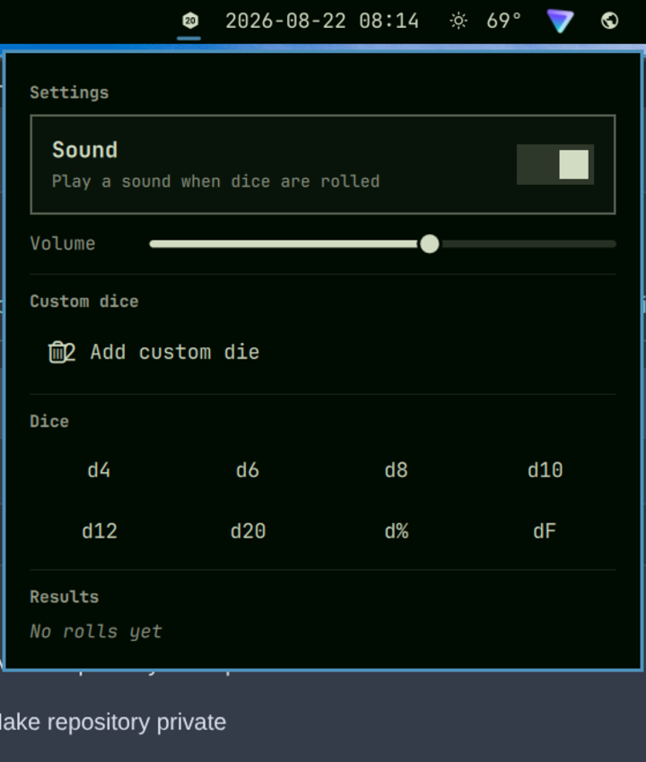

# RPG Dice

An [Omarchy](https://omarchy.org/) shell plugin that rolls tabletop RPG dice
from the status bar — standard polyhedral dice, Fate dice, and your own custom
dice, with an optional roll sound.



## Features

- **Standard dice** — d4, d6, d8, d10, d12, d20, d% (d100).
- **Fate dice (dF)** — six faces: two `-`, two blank, two `+`.
- **Custom dice** — numeric (1–1,000,000 sides) or explicit sides (any labels,
  e.g. `heads, tails` or `1, 2, sword, shield`).
- **Three-section panel** — Settings, Dice, Results.
- **Debounced rolling** — click any number of dice, then 1.5s after your last
  click everything rolls together and groups by type (`d6: 2, 5, 3   d8: 8`).
- **Sound** — toggleable roll sound with adjustable volume.
- **Persistent state** — sound, volume, and custom dice survive restarts.

## Installation

```sh
omarchy plugin add ssh://git@git.packden.us:2288/crueber/omarchy-plugin-rpgdice.git --enable
```

Or clone manually:

```sh
git clone ssh://git@git.packden.us:2288/crueber/omarchy-plugin-rpgdice.git \
  ~/.config/omarchy/plugins/crueber.rpgdice
omarchy-shell shell rescanPlugins
omarchy plugin enable crueber.rpgdice center
```

## Usage

Click the d20 icon in the bar to open the panel.

- **Roll** — click one or more dice buttons. The panel waits 1.5s after your
  last click, then rolls everything together. Results group identical dice:
  `d6: 3, 4, 5`, joined per type for mixed rolls.
- **Custom dice** — expand **Add custom die** in Settings. Pick *Numeric* and
  enter a side count (1–1,000,000), or *Explicit sides* and enter
  comma-separated labels, then **Add die**. Custom dice appear as roll buttons
  in the Dice section.
- **Sound** — toggle it and adjust volume in Settings.

## Configuration

The bar icon is overridable via the widget's entry in
`~/.config/omarchy/shell.json` (the default is the d20 glyph, U+F1155):

```json
{ "id": "crueber.rpgdice", "icon": "d20" }
```

## Development

The shell hot-reloads on save, so changes under
`~/.config/omarchy/plugins/crueber.rpgdice/` apply automatically. If a change
fails to land, force a reload:

```sh
omarchy-shell shell rescanPlugins
omarchy restart shell
```

Layout:

| File | Purpose |
|------|---------|
| `manifest.json` | Plugin manifest (id, kinds, entry points, widget metadata) |
| `BarWidget.qml` | Bar pill (d20 icon), panel lifecycle, and IPC |
| `Panel.qml` | Popup panel: Settings/Dice/Results sections, roll debounce, sound, persistence |
| `Model.js` | Pure dice logic and state (de)serialization — no QML imports |
| `assets/dice-roll.wav` | Bundled roll sound |

Where the logic lives:

- **Dice model** — `STANDARD_DICE` and `FATE_DIE` in `Model.js`. Add a new
  built-in die by appending to `STANDARD_DICE`; the Dice grid picks it up
  automatically.
- **Rolling** — `Model.rollDie(die)` returns `{ label, display, value }`.
  Fate and explicit-sides dice are non-additive (`value: null`); only numeric
  dice contribute to the group total in `Panel.qml:rollAll()`.
- **Debounce** — `Panel.qml`'s `debounceTimer` (1.5s) restarts on each
  `queueDie()` and rolls the accumulated `pending` list on timeout.
- **Persistence** — state is JSON under
  `~/.local/state/omarchy/rpgdice/state.json`, read with `FileView` and written
  via `Util.execDetached`.

Validate before publishing:

```sh
omarchy plugin validate ~/.config/omarchy/plugins/crueber.rpgdice
```

## License

[MIT](LICENSE)